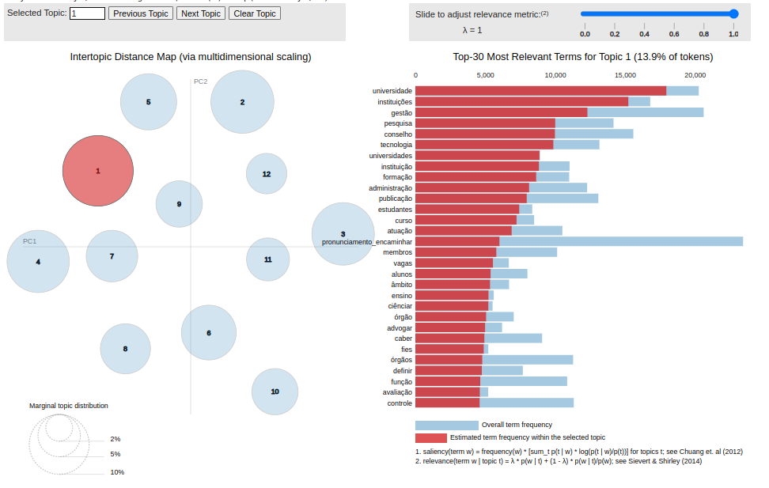
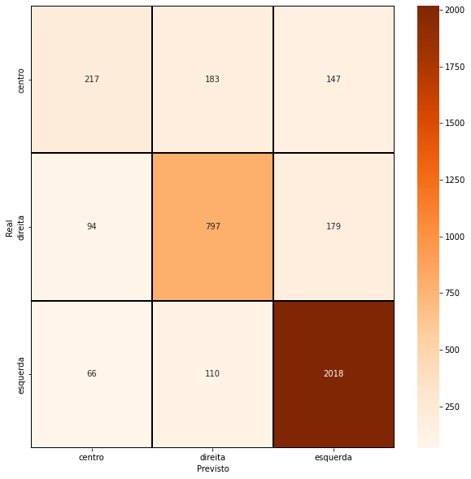
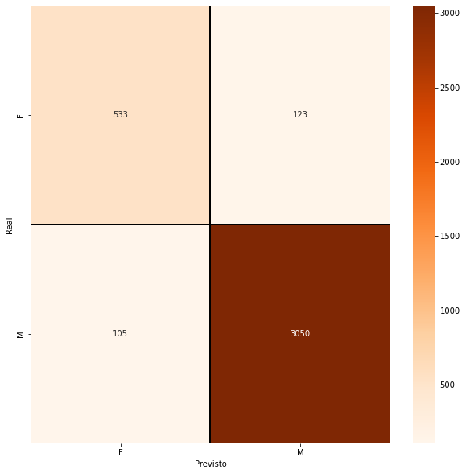

# Análise de discursos de deputados e deputadas federais através de técnicas de NLP e machine learning

#### Aluno: [Rodrigo Montenegro de Oliveira](https://github.com/rmontenegroo)
#### Orientador: [Dr. Leonardo Forero Mendoza] (https://www.linkedin.com/in/leonardo-alfredo-forero-mendoza-53803159/)

---

Trabalho apresentado ao curso [BI MASTER](https://ica.puc-rio.ai/bi-master) como pré-requisito para conclusão de curso e obtenção de crédito na disciplina "Projetos de Sistemas Inteligentes de Apoio à Decisão".

- [Link para o código](https://github.com/rmontenegroo/discursos)
  - [Extração e análise] (01_nlp_discursos_camara_extracao_e_analise.ipynb)
  - [Geração de embedding] (02_nlp_discursos_camara_w2v.ipynb)
  - [Teste do embedding] (03_nlp_discursos_camara_w2v_similaridade_e_PCA.ipynb)
  - [Classificação automática de discursos com LDA e Nuvem de palavras] (04_nlp_discursos_camara_LDA.ipynb)
  - [Separação e preparo das bases de treino e teste para classificadores] (05_nlp_discursos_camara_separacao_discursos.ipynb)
  - [Classficador dos discurssos por espectro político (esquerda, centro e direita)](06_01_nlp_discursos_camara_classficador_por_espectro_esq_cen_dir.ipynb)
  - [Classificador dos discursos por gênero do discursante] (06_02_nlp_discursos_camara_classficador_por_genero.ipynb)

- [Dados extraídos e modelos obtidos] (https://drive.google.com/drive/folders/1-5KmIeVTRsBUq6oOkMQVGGQxvrMhqdMJ?usp=sharing)
  Para quem quiser utilizar os dados e não estiver disposto a passar por toda as fases de extração, os dados, bem como os modelos gerados estão disponíveis no link acima.

---

### Resumo

Neste projeto discursos de deputados e deputadas federais do congresso brasileiro são analisados empregando-se técnicas de mineração de dados, NLP e machine learning. 

### 1. Introdução

 É quase senso comum que é difícil encontrar coerência entre o discurso e o alinhamento político de muitos dos nossos representantes no congresso e demais poderes. Uma vez que os discursos na câmara federal foram transcritos e disponibilizados, colocamos essa coerência, ou falta dela, a prova, empregando técnicas de mineração de dados, NLP e machine learning.

 Na primeira etapa do projeto [01_nlp_discursos_camara_extracao_e_analise] (01_nlp_discursos_camara_extracao_e_analise.ipynb) é feita a extração dos dados: discursos e perfis dos deputados e deputadas do congresso. Em posse desses dados, faz-se uma breve análise sobre as características dos discursantes.

 Em [02_nlp_discursos_camara_w2v] os discursos obtidos na etapa anterior são processados e são gerados os embeddings Word2Vector que são utilizados em praticamente todas as etapas seguintes.

 Para avaliar a qualidade do embedding gerado na etapa 02, na etapa [03_nlp_discursos_camara_w2v_similaridade_e_PCA](03_nlp_discursos_camara_w2v_similaridade_e_PCA.ipynb) são aplicados o PCA para observar a distribuição dos tokens em relação aos seu pares, e também são realizados alguns testes de similaridade através do cálculo do coseno entre os vetores.

 Na etapa [04_nlp_discursos_camara_LDA.ipynb] (04_nlp_discursos_camara_LDA.ipynb) é aplicado o algoritmo de LDA sobre os discursos para se obter uma classificação não supervisionada dos mesmos. Aqui também emprega-se nuvem de palavras para se visualizar os principais tokens presentes nos discursos e identificar eventuais distorções.

 Para as etapas de classificação supervisionada que virão em seguida é necessário separar a base de discursos em treino e teste para que sejam apresentadas aos classificadores. Esse exercício da separação das bases foi realizado aqui em [05_nlp_discursos_camara_separacao_discursos] (05_nlp_discursos_camara_separacao_discursos.ipynb).

 Para tentar encontrar alguma relação entre o conteúdo dos discursos e o espectro político do partido do discursante, na etapa [06_01_nlp_discursos_camara_classficador_por_espectro_esq_cen_dir](06_01_nlp_discursos_camara_classficador_por_espectro_esq_cen_dir.ipynb) apresenta-se a uma rede RNN os discursos proferidos na última legislatura.

 E para verificar se seria possível identificar o gênero do discursante apenas pelo discurso, aplica-se o mesmo conjunto da base anterior contra a mesma rede RNN da etapa anterior, aqui em [06_02_nlp_discursos_camara_classficador_por_genero] (06_02_nlp_discursos_camara_classficador_por_genero.ipynb).

### 2. Modelagem

#### [Extração e análise] (01_nlp_discursos_camara_extracao_e_analise.ipynb)

O primeiro passo é obter a lista das [legislaturas com dados disponíveis no site da câmara] (https://dadosabertos.camara.leg.br/arquivos/legislaturas/csv/legislaturas.csv), utilizando a biblioteca Pandas para ler os arquivos CSV. Em seguida obtem-se a [listagem dos parlamentares que já integraram a câmara] (https://dadosabertos.camara.leg.br/arquivos/deputados/csv/deputados.csv). De posse da listagem de legislaturas e dos parlamentares, obtem-se as [transcrições dos discursos](https://dadosabertos.camara.leg.br/api/v2/deputados/{idDeputado}/discursos?idLegislatura={idLegislatura}&ordenarPor=dataHoraInicio&ordem=ASC). Da listagem de deputados obtem-se a url que contém as informações detalhadas do parlamentar, tais como, CPF, partido, escolaridade, sexo, etc. 

O espectro político dos partidos não está em nenhuma das fontes mencionadas acima. Através de pesquisa em [pt.wikipedia.org] (https://pt.wikipedia.org) e congressoemfoco.uol.com.br(https://congressoemfoco.uol.com.br/area/governo/exclusivo-os-12-partidos-que-formam-a-base-fiel-do-governo-na-camara/) fez-se a associção manual entre partidos e o espectro político predominante. 

Em uma última etapa essas informações são unificadas em um único dataframe Pandas e gravada em arquivo para uso posterior.

#### [Geração de embedding] (02_nlp_discursos_camara_w2v.ipynb)

Para uso em fases posteriores, faz-se o embedding em Word2Vector a partir de todos os discursos obtidos na etapa anterior. 

Para cada discurso, foram calculadas as sentenças, os tokens e os lemmas. Em seguida, faz-se uma breve análise dos tokens mais frequentes e então são criados os embeddings de dimensões 50, 100 e 300. Para a criação dos embeddings utiliza-se uma janela de tamanho 10 e uma ocorrência mínima do token de 5.

#### [Separação e preparo das bases de treino e teste para classificadores] (05_nlp_discursos_camara_separacao_discursos.ipynb)

A fim de estar sempre utilizando o mesmo dataset nas várias e várias diferentes execuções de modelos com diferentes parâmetros, fez-se necessário a padronização da criação do dataset final a ser usado.

Para buscar discursos com um conjunto de tokens pudessem oferecer um melhor resultado, testou-se várias faixas de tamanho de discurso, finalizando com discursos de tamanho máximo de 1000 tokens e com o mínimo de 250 tokens.

E para facilitar ainda mais a busca de alguma coerência, resolveu-se descartar, a princípio, discursos de partidos considerados de áreas menos deterministícas do espectro: extrema-direita, extrema-esquerda, centro-direita e centro-esquerda. Portanto, no dataset final, só são considerados os espectros: direita, esquerda e centro.

O dataset é então separado em treino e teste pela função train_test_split da bibilioteca Sklearn, de forma estratificada, garantindo a proporção das classes de espectros entre treino e teste.

#### [Classficador dos discurssos por espectro político (esquerda, centro e direita)](06_01_nlp_discursos_camara_classficador_por_espectro_esq_cen_dir.ipynb) e [Classificador dos discursos por gênero do discursante] (06_02_nlp_discursos_camara_classficador_por_genero.ipynb)

Em ambos os casos, usou-se uma rede RNN. No futuro é interessante tentar comparar os resultados com redes densas somente, bem como modelos de SVM e Árvores de decisão. A única diferença das redes é o tamanho da camada de saída, de forma que para classificar por espectro são de tamanho 3, e para gênero, 2.

Para os treinamentos das redes o embedding de dimensão 100 foi o escolhido por apresentar resultados um pouco melhores que o de dimensão 50. O de dimensão 300 não foi utilizado pois gerava um altíssimo uso de memória.

Os parêmetros da rede são:

```
BATCH_SIZE = 200
EPOCHS = 250
PATIENCE_LR = 25
PATIENCE_ES = 50
FACTOR = 0.25
MIN_LR = 0.00000001
PLATEAU_MONITOR = 'val_categorical_crossentropy'
LSTM_LAYER1_SIZE = EMBEDDINGS_DIM
LSTM_LAYER2_SIZE = EMBEDDINGS_DIM
LAYER1_DROPOUT_RATE = 0.1
LAYER2_DROPOUT_RATE = 0.25
RECURRENT_DROPOUT_RATE = 0.2
DENSE_LAYER1_SIZE = EMBEDDINGS_DIM
DENSE_LAYER1_DROPOUT_RATE = 0.5
DENSE_LAYER2_SIZE = EMBEDDINGS_DIM
DENSE_LAYER1_FUNCTION = 'tanh'
OUTPUT_LAYER_SIZE = len(ESPECTROS)
OUTPUT_LAYER_FUNCTION = 'softmax'
LEARNING_RATE = 0.0001
OPTIMIZER = tensorflow.keras.optimizers.Adam
LOSS_FUNCTION = 'categorical_crossentropy'
METRIC_FUNCTIONS = ['categorical_accuracy', 'categorical_crossentropy']
VALIDATION_SPLIT_RATE = 0.2

# Modelo
model = Sequential()

# INPUT
model.add(Embedding(MAX_FEATURES+1, output_dim = EMBEDDINGS_DIM, weights = [embeddings_matrix], input_length = MAX_DOC_LEN, trainable = True, mask_zero=True))

# LSTM 1
model.add(Bidirectional(LSTM(LSTM_LAYER1_SIZE, return_sequences = True,  dropout = LAYER1_DROPOUT_RATE)))

# LSTM 2
model.add(Bidirectional(LSTM(LSTM_LAYER2_SIZE, dropout = LAYER2_DROPOUT_RATE, recurrent_dropout = RECURRENT_DROPOUT_RATE)))

# Dense 1
model.add(Dense(units = DENSE_LAYER1_SIZE, activation = DENSE_LAYER1_FUNCTION))
model.add(Dropout(DENSE_LAYER1_DROPOUT_RATE))

# Dense 2
model.add(Dense(DENSE_LAYER2_SIZE))

# Output
model.add(Dense(units = OUTPUT_LAYER_SIZE, activation = OUTPUT_LAYER_FUNCTION))

# Compile
model.compile(optimizer = OPTIMIZER(learning_rate = LEARNING_RATE), loss = LOSS_FUNCTION, metrics = METRIC_FUNCTIONS)
```

### 3. Resultados

#### [Teste do embedding] (03_nlp_discursos_camara_w2v_similaridade_e_PCA.ipynb)

Após a criação dos embeddings, faz-se uma análise da qualidade dos mesmos, utilizando-se tanto uma inspeção visual com a distribuição espacial dos tokens com a aplicação de PCA, como alguns exemplos de similaridades pelo cálculo do coseno dos vetores que representam os tokens.

Embedding de dimensão 50:

```
model50.wv.most_similar(['eleição',], topn=10)
[('chapa', 0.7998121976852417),
 ('legenda', 0.7513555288314819),
 ('diplomação', 0.7347360253334045),
 ('campanha', 0.715898871421814),
 ('disputa', 0.7108612060546875),
 ('candidatura', 0.7085728049278259),
 ('reeleição', 0.6936697363853455),
 ('nominata', 0.6905341148376465),
 ('escolha', 0.6899633407592773),
 ('coligação', 0.6817782521247864)]
 ```

Embedding de dimensão 100:

```
model100.wv.most_similar(['eleição',], topn=10)
[('chapa', 0.6608370542526245),
 ('reeleição', 0.6185973882675171),
 ('legenda', 0.5809950828552246),
 ('derrota', 0.5678537487983704),
 ('coligação', 0.5664817690849304),
 ('circunscrição', 0.5375480651855469),
 ('sucessão', 0.5333110690116882),
 ('disputa', 0.5268260836601257),
 ('campanha', 0.5264191627502441),
 ('urna', 0.5213162302970886)]
 ```

 Embedding de dimensão 300:

 ```
 model300.wv.most_similar(['eleição',], topn=10)
 [('chapa', 0.43945544958114624),
 ('campanha', 0.4094240069389343),
 ('legenda', 0.4077368378639221),
 ('agremiação', 0.40758994221687317),
 ('candidatura', 0.3883979916572571),
 ('reeleição', 0.3815804123878479),
 ('sucessão', 0.3806329667568207),
 ('coligação', 0.3779691457748413),
 ('eleições', 0.37733665108680725),
 ('disputa', 0.37556082010269165)]
 ```

#### [Classificação automática de discursos com LDA e Nuvem de palavras] (04_nlp_discursos_camara_LDA.ipynb)

##### Nuvem de palavras

Para a nuvem de palavras descartou-se alguns tokens muito comuns no início dos discursos e pronomes de tratamento, como:

```
    'sr', 'sra', 'srs', 'sras', 'a', 'e', 'o', 'as', 'os', 'da', 'de', 'do', \
    'das', 'dos', 'à', 'às', 'um', 'uma', 'uns', 'umas', 'ao', 'aos', \
    'presidente', 'quero', 'obrigado', 'importante', 'importantes', 'momento', \ 'governo', 'nº', 'parabéns', 'parabenizar', 'casa', 'deputado', \
    'deputados', 'agradecer', 'senhor', 'senhora', 'senhores', 'senhoras', \
```

Calculou-se os bigramas e trigramas presentes nos discursos. E então antes de gerar a nuvem de palavras, filtrou-se os tokens em somente substantivos e verbos utilizando-se o PoS tagging da biblioteca Spacy.


Após filtragem de tokens com ocorrência mínima de 3, e não mais frequentes do que em 5% dos discursos:


###### LDA

Após uma busca de hiperparâmetros baseada no valor de coerência (coherence_score = 0.395099), o LDA foi executado com:

```
k = 12 # (quantidade de tópicos);
alpha = 1; e 
beta = 0.5
```

Para visualizar o resultado do LDA, utiliza-se a biblioteca pyLDAvis:




#### [Classficador dos discurssos por espectro político (esquerda, centro e direita)](06_01_nlp_discursos_camara_classficador_por_espectro_esq_cen_dir.ipynb) 

O modelo apresentou uma acurácia de 94.02% na base de treinamento e de 79.56% na de teste. Apesar de não estar explicitado neste trabalho, diversas combinações entre parâmetros foram utilizadas e apesar deste ter sido a melhor acurária para a base de teste, esta métrica oscilou na maior parte das rodadas entre 60 e 78%.





#### [Classificador dos discursos por gênero do discursante] (06_02_nlp_discursos_camara_classficador_por_genero.ipynb)

Apesar da base de discursos ter sido estratificada (descuidadamente) somente por espectro, quanto a gênero os datasets de treino e teste mantiveram aparentemente a mesma proporção:


Para a base de treino o modelo apresentou uma acurácia de 99% e na base de teste 94%:




### 4. Conclusões


---

Matrícula: 202.100.270

Pontifícia Universidade Católica do Rio de Janeiro

Curso de Pós Graduação *Business Intelligence Master*
